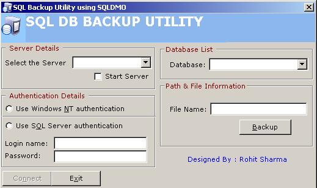



## SQL DataBase Backup Using SQLDMO Onject

### Description

Using this code You can easily backup your sql database. There were some code here that used ADO for the backup purpose, here in my code i have used the SQLDMO object for all the sql transactions.

Few code are taken from here and are upgraded with comments.

Hope you all would like the work
 
### More Info
 

             |
---                |---
**Submitted On**   |2004-08-05 08:43:06
**By**             |[Rohit Sharma](https://github.com/Planet-Source-Code/PSCIndex/blob/master/ByAuthor/rohit-sharma.md)
**Level**          |Intermediate
**User Rating**    |4.8 (19 globes from 4 users)
**Compatibility**  |VB 6\.0
**Category**       |[Databases/ Data Access/ DAO/ ADO](https://github.com/Planet-Source-Code/PSCIndex/blob/master/ByCategory/databases-data-access-dao-ado__1-6.md)
**World**          |[Visual Basic](https://github.com/Planet-Source-Code/PSCIndex/blob/master/ByWorld/visual-basic.md)
**Archive File**   |[SQL\_DataBa177809852004\.zip](https://github.com/Planet-Source-Code/rohit-sharma-sql-database-backup-using-sqldmo-onject__1-55371/archive/master.zip)

